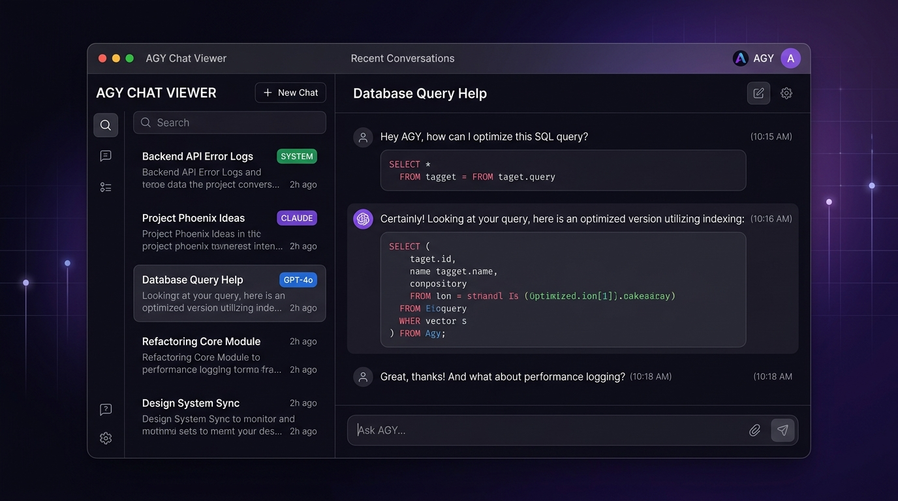

<p align="center">
  
</p>

<h1 align="center">AGY Chat Viewer</h1>

<p align="center">
  <strong>A beautiful web-based GUI for browsing your Google Antigravity CLI (agy) chat history</strong>
</p>

<p align="center">
  <a href="#features">Features</a> •
  <a href="#quick-start">Quick Start</a> •
  <a href="#auto-start-on-boot">Auto-Start</a> •
  <a href="#tech-stack">Tech Stack</a> •
  <a href="#license">License</a>
</p>

---

## Why?

The [Google Antigravity CLI](https://github.com/google/anthropic-cli) (`agy`) saves all your conversations as JSONL transcript files buried deep inside `~/.gemini/antigravity-cli/brain/`. Navigating raw JSON logs to find a past conversation is painful.

**AGY Chat Viewer** gives you a premium, dark-themed web interface to instantly browse, search, and manage all your past `agy` sessions — right from your browser.

---

## Features

- 🔍 **Intelligent Multi-Word Search** — Search across all chat titles and full message content. Chats matching *all* search words rank first, followed by partial matches.
- 📌 **Pin & Unpin Chats** — Pin important conversations to the top of the sidebar for quick access (persisted in localStorage).
- 🗑️ **Delete Chats** — Remove unwanted conversations directly from the UI with a confirmation prompt.
- 🧠 **Model Badges** — Instantly see which AI model (Gemini Pro, Claude Opus, Sonnet, etc.) was used for each conversation with color-coded badges.
- 📂 **Workspace Path Display** — See the exact project directory each chat was initiated from, with a one-click `cd` copy button.
- 🕐 **Smart Sorting** — Chats are sorted by most recent activity (not just creation date), so actively used old chats bubble to the top.
- 💭 **Thinking Blocks** — Toggle visibility of the AI's internal reasoning/thinking blocks.
- 🔧 **Tool Call Inspector** — Expand any tool call to see the full arguments and parameters used.
- 📋 **Copy Session ID** — One-click copy of the conversation ID to resume sessions via `agy --conversation <id>`.
- 🌙 **Premium Dark UI** — Sleek glassmorphism design with smooth animations and micro-interactions.

---

## Quick Start

### Prerequisites

- [Node.js](https://nodejs.org/) v18 or higher
- [Google Antigravity CLI](https://github.com/google/anthropic-cli) (`agy`) installed and used at least once

### Install & Run

```bash
git clone https://github.com/L-koder/agy-chat-viewer.git
cd agy-chat-viewer
npm install
node server.js
```

Open **http://localhost:3777** in your browser. That's it! 🚀

---

## Auto-Start on Boot (Optional)

To run the viewer as a background service that starts automatically on login:

```bash
mkdir -p ~/.config/systemd/user

cat > ~/.config/systemd/user/agy-chat-viewer.service << EOF
[Unit]
Description=AGY Chat Viewer Web Server
After=network.target

[Service]
Type=simple
WorkingDirectory=$HOME/agy-chat-viewer
ExecStart=$(which node) $HOME/agy-chat-viewer/server.js
Restart=on-failure
RestartSec=5
Environment=HOME=$HOME

[Install]
WantedBy=default.target
EOF

systemctl --user daemon-reload
systemctl --user enable --now agy-chat-viewer.service
loginctl enable-linger $(whoami)
```

The viewer will now auto-start on boot and be available at `http://localhost:3777`.

**Useful commands:**
```bash
systemctl --user status agy-chat-viewer    # Check status
systemctl --user restart agy-chat-viewer   # Restart after updates
systemctl --user stop agy-chat-viewer      # Stop the service
```

---

## How It Works

AGY Chat Viewer reads the transcript files stored by the `agy` CLI at:

```
~/.gemini/antigravity-cli/brain/<conversation-id>/.system_generated/logs/transcript.jsonl
```

It parses each conversation to extract:
- The first user message (used as the chat title)
- The AI model used
- Message timestamps and step counts
- Full message content for search indexing
- Workspace/project directory paths from tool calls

No data is modified, sent externally, or stored elsewhere — everything stays on your local machine.

---

## Tech Stack

| Component | Technology |
|-----------|-----------|
| Backend | Node.js + Express |
| Frontend | Vanilla HTML/CSS/JS |
| Data | JSONL transcript parsing |
| Storage | localStorage (pins) |

Zero external dependencies beyond Express. No build step required.

---

## License

ISC

---

<p align="center">
  Made with ❤️ for the AGY community
</p>
